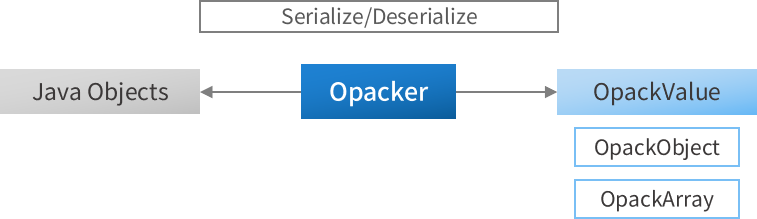
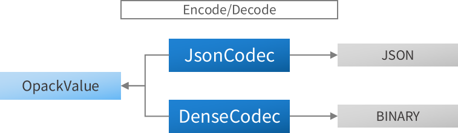

<h1 align="center" style="max-width: 100%; font-weight: bold;">
  <a href="https://github.com/realtimetech-solution/opack"></a></br>
  Opack
</h1>

<p align="center" style="max-width: 100%;">
  <a href="#"></a>
  <a href="./actions/workflows/windows-x64.yml"></a>
  <a href="https://maven-badges.herokuapp.com/maven-central/com.realtimetech/opack"></a>
</p>

Opack is a Java library that can serialize/deserialize between Java objects and common objects(OpackValue). Also, common objects can be encoded or decoded as JSON or Bytes(Dense).

**We faster then GSON and Kryo.** (See [tests](./src/test/java/com/realtimetech/opack/test/performance))
<details>
  <summary>Click to see performance result</summary>

```
# GsonPerformanceTest
  Gson  : 7094ms
  Opack : 2613ms

# KryoPerformanceTest
 Kryo  : 7227ms
 Opack : 2304ms

# JacksonPerformanceTest
 Jackson: 6412ms
 Opack  : 6404ms
```

</details>

### Simple flow

<p align="center" style="max-width: 100%;">
  <a href="#"></a>
</p>

<p align="center" style="max-width: 100%;">
  <a href="#"></a>
</p>

### Download

Gradle:

```gradle
dependencies {
  implementation 'com.realtimetech:opack:0.0.9'
}
```

Maven:

```xml

<dependency>
    <groupId>com.realtimetech</groupId>
    <artifactId>opack</artifactId>
    <version>0.0.9</version>
</dependency>
```

### Usage

#### 1. Serialize

```java
public class Usage {
    public static void main(String[] arguments) {
        Opacker opacker = new Opacker.Builder().create();

        SomeObject someObject = new SomeObject();

        OpackValue opackValue = opacker.serialize(someObject);
    }
}
```

#### 2. Deserialize

```java
public class Usage {
    public static void main(String[] arguments) {
        Opacker opacker = new Opacker.Builder()
                .setContextStackInitialSize(128)                    // (Optional) Creation size of stack for processing
                .setValueStackInitialSize(512)                      // (Optional) Creation size of stack for processing

                .setEnableWrapListElementType(false)                // (Optional) When converting elements of a list, record the type as well
                .setEnableWrapMapElementType(false)                 // (Optional) When converting elements of a map, record the type as well
                .setEnableConvertEnumToOrdinal(false)               // (Optional) Convert enum to ordinal or name
                .setEnableConvertRecursiveDependencyToNull(false)   // (Optional) Convert recursive depandency, record null
                .create();

        OpackValue serializedSomeObject = null;

        SomeObject someObject = opacker.deserialize(SomeObject.class, serializedSomeObject);
    }
}
```

#### 3. Json Codec

```java
public class Usage {
    public static void main(String[] arguments) {
        JsonCodec jsonCodec = new JsonCodec.Builder()
                .setEncodeStackInitialSize(128)             // (Optional) Creation size of stack for processing
                .setEncodeStringBufferSize(1024)            // (Optional) Creation size of stack for processing
                .setDecodeStackInitialSize(128)             // (Optional) Creation size of stack for processing

                .setAllowOpackValueToKeyValue(false)        // (Optional) Accepts Object or Array as Key of Json Object
                .setEnableConvertCharacterToString(false)   // (Optional) Convert character to string instead of character int value
                .setUsePrettyFormat(false)                  // (Optional) When encoding, it prints formatted

                .create();

        OpackValue opackValue = /* See Serialize Usage */;

        // Encode Basic
        String json = jsonCodec.encode(opackValue);

        // Encode with Java IO Writer
        Writer writer = /* Java IO Writer */;
        jsonCodec.encode(writer, opackValue);

        // Decode Basic
        OpackValue decodedOpackValue = jsonCodec.decode(json);
    }
}
```

#### 4. Dense Codec

```java
public class Usage {
    public static void main(String[] arguments) {
        DenseCodec denseCodec = new DenseCodec.Builder()
                .setEncodeStackInitialSize(128)         // (Optional) Creation size of stack for processing
                .setDecodeStackInitialSize(128)         // (Optional) Creation size of stack for processing

                .setIgnoreVersionCompare(false)         // (Optional) Ignore compare dense codec version in data

                .create();

        OpackValue opackValue = /* See Serialize Usage */;

        // Encode Basic
        byte[] bytes = denseCodec.encode(opackValue);

        // Encode with Java IO OutputStream
        OutputStream outputStream = /* Java IO OutputStream */;
        denseCodec.encode(OutputStreamWriter.of(outputStream), opackValue);

        // Encode with ByteArrayWriter
        ByteArrayWriter byteArrayWriter = new ByteArrayWriter();
        denseCodec.encode(byteArrayWriter, opackValue);
        byte[] bytes = byteArrayWriter.toByteArray();

        // Decode Basic
        OpackValue decodedOpackValue = denseCodec.decode(bytes);

        // Decode with Java IO InputStream
        InputStream inputStream = /* Java IO InputStream */;
        OpackValue decodedOpackValue = denseCodec.decode(InputStreamReader.of(inputStream));

        // Decode with ByteArrayReader
        ByteArrayReader byteArrayReader = new ByteArrayReader(bytes);
        OpackValue decodedOpackValue = denseCodec.decode(byteArrayReader);
    }
}
```

### Advanced Usage

#### 1. Ignore and Type and Name

```java
public class SomeObject {
    private String stringField;
    private byte[] bytesField;

    // This field will not serialize/deserialize
    @Ignore
    private String verySecretField;

    // This field will serialize/deserialize to explicit type `ArrayList` instead of ambiguous field type `List`
    @Type(ArrayList.class)
    private List<String> listField;
 
    // This field will serialize/deserialize to `newFieldName` name instead of actual field name `oldFieldName`
    @Name("newFieldName")
    private String oldFieldName;
}
```

#### 2. Field Transformer

```java
public class ByteToBase64Transformer implements Transformer {
    @Override
    public Object serialize(Opacker opacker, Object value) throws SerializeException {
        if (value instanceof byte[]) {
            return Base64.getEncoder().encodeToString((byte[]) value);
        }

        return value;
    }

    @Override
    public Object deserialize(Opacker opacker, Class<?> goalType, Object value) throws DeserializeException {
        if (value instanceof String) {
            return Base64.getDecoder().decode((String) value);
        }

        return value;
    }
}

public class SomeObject {
    // This field will serialize/deserialize to Base64
    @Transform(transformer = ByteToBase64Transformer.class)
    private byte[] bytesField;
}
```

#### 3. Field With Type

```java
public class SomeObject {
    // This field will serialize with runtime type, and deserialize actual type instead of ambiguous field type `List`
    @WithType
    private List<String> stringListField;

    // This field will serialize with runtime type, and deserialize actual type instead of ambiguous field type `Object`
    @WithType
    private Object[] objectArrayField;
}
```

#### 4. Class Transformer

```java
public class AnimalTransformer implements Transformer {
    // Remove a `sound` from a serialized `Animal`
    @Override
    public Object serialize(Opacker opacker, Object value) throws SerializeException {
        if (value instanceof Animal) {
            Animal animal = (Animal) value;
            OpackValue opackValue = opacker.serialize(animal);

            if (opackValue instanceof OpackObject) {
                OpackObject opackObject = (OpackObject) opackValue;
                opackObject.remove("sound");
                return opackObject;
            }
        }

        return value;
    }

    // Restore `sound` from `Animal` before deserialization
    @Override
    public Object deserialize(Opacker opacker, Class<?> goalType, Object value) throws DeserializeException {
        if (value instanceof OpackObject) {
            if (Animal.class.isAssignableFrom(goalType)) {
                OpackObject opackObject = (OpackObject) value;
                Animal animal = (Animal) opacker.deserialize(goalType, opackObject);
                animal.setSound(animal.bark());
            }
        }

        return value;
    }
}

// When `inheritable` is set to true, it applies to child classes.
@Transform(transformer = AnimalTransformer.class, inheritable = true)
abstract class Animal {
    private String sound;

    public abstract String bark();

    public String getSound() {
        return sound;
    }

    public void setSound(String sound) {
        this.sound = sound;
    }
}

public class Dog extends Animal {
    @Override
    public String bark() {
        return "Bow-Wow";
    }
}

public class SomeObject {
    private Dog dogField;
}
```

#### 5. Handling Opack Value

```java
public class Usage {
    public static void main(String[] arguments) {
        OpackObject<String, OpackValue> rootObject = new OpackObject<>();

        {
            OpackArray<Integer> opackArray = new OpackArray<>();
            opackArray.add(Integer.MAX_VALUE);
            rootObject.put("array", opackArray);
        }

        {
            OpackArray<?> opackArray = OpackArray.createWithArrayObject(new int[]{1, 2, 3, 4, 5, 6});
            rootObject.put("unmodifiable(but, really fast) array", opackArray);
        }

        {
            OpackObject<Object, Object> opackObject = new OpackObject<>();
            opackObject.put("int", 1);
            opackObject.put("float", 1.1f);
            opackObject.put("long", Long.MAX_VALUE);
            opackObject.put("double", 1.1d);

            opackObject.put(1024, "2^10");
            opackObject.put(
                    OpackArray.createWithArrayObject(new byte[]{1, 2, 3, 4, 5}),
                    "a lot of bytes"
            );

            rootObject.put("number_map", opackObject);
        }

        OpackArray<Integer> opackArray = (OpackArray) rootObject.get("array");
        OpackObject<Object, Object> opackObject = (OpackObject) rootObject.get("number_map");

        System.out.println("1024 is " + (opackObject.get(1024)));
        System.out.println("Array length is " + (opackArray.length()));
        System.out.println("First element is " + (opackArray.get(0)));
    }
}
```

### To-Do

- [ ] Separate field transformer and class transformer
- [ ] Add generic into transformer for type safety
- [ ] Add field pre/post transformer
- [ ] Remove `fieldTransformer` argument of `Opacker.prepareObjectDeserialize`
- [ ] Remove `withType` argument of `Opacker.prepareObjectDeserialize`

### License

Opack uses [Apache License 2.0](./LICENSE.txt). Please, leave your feedback if you have any suggestions!

```
Jeonghwan, Park
+821032735003
dev.parkjeonghwan@gmail.com
```